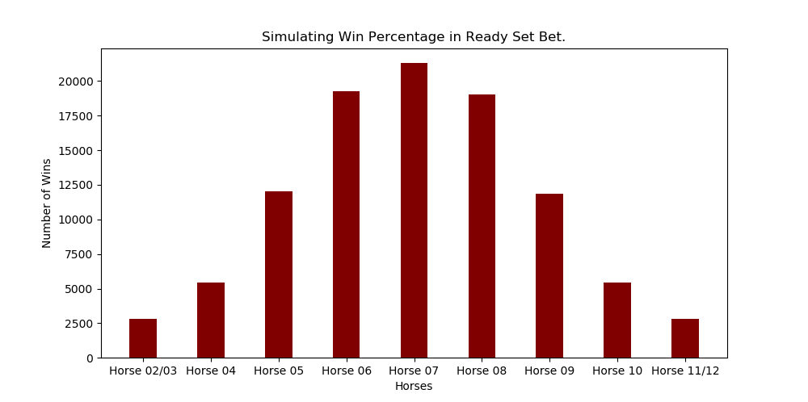
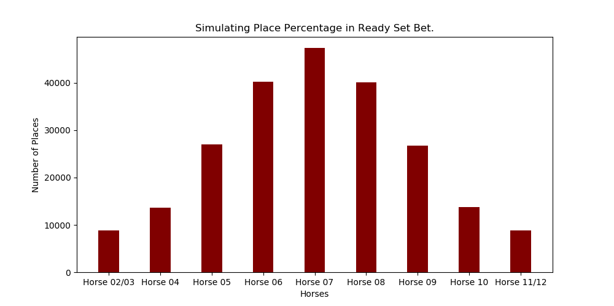
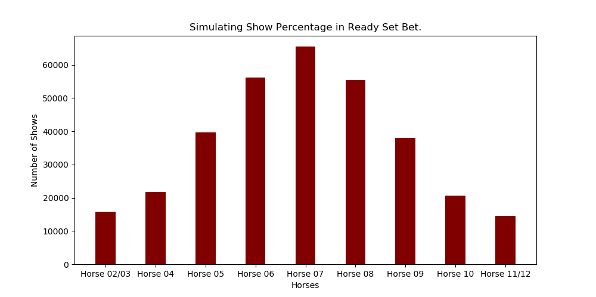

# Ready Set Bet Simulator

A simple Python Simulator to calculate odds in Ready Set Bet the board game.

## Description

This python script is used to calculate the expected horse win percentages based on the game rules of Ready Set Bet.

### Rules

The race is simulated by rolling 2 six sided dice and adding the result of that roll. Each horse has a number 2-12 written on the horse, the horses on the ends of the track are combined so numbers 2/3 and 11/12 are each combined into one horse.

Once a horses number is rolled it advances 1 square. A horse has to move 15 squares forward to win. 

If a number is rolled twice in a row some horses get a boost based on how infrequent it is rolled from 0 to +3.

## Results

The following sections contain the results of a 100,000 simulated races. 

### Simulated Win Percentage
```
Total Races: 100000
Horse 02/03 - 0.0282
Horse 04 - 0.0544
Horse 05 - 0.1206
Horse 06 - 0.1924
Horse 07 - 0.2131
Horse 08 - 0.1904
Horse 09 - 0.1188
Horse 10 - 0.0544
Horse 11/12 - 0.0280
```



### Simulated Place Percentage
```
Total Places: 226530
Place %
Horse 02/03 - 0.0393
Horse 04 - 0.0602
Horse 05 - 0.1194
Horse 06 - 0.1777
Horse 07 - 0.2090
Horse 08 - 0.1771
Horse 09 - 0.1179
Horse 10 - 0.0605
Horse 11/12 - 0.0390
```


### Simulated Show Percentage
```
Total Shows: 327289
Show %
Horse 02/03 - 0.0481
Horse 04 - 0.0664
Horse 05 - 0.1209
Horse 06 - 0.1716
Horse 07 - 0.2000
Horse 08 - 0.1692
Horse 09 - 0.1163
Horse 10 - 0.0629
Horse 11/12 - 0.0446
```


### Rolling Two Six Sided Dice

I have included here a table of simply rolling 2 six sided dice for comparison to the percentages shown above. 

| Number | % |
| - | ---|
|2 | 2.80% |
|3 | 5.60% |
|4 | 8.30% |
|5 | 11.10% |
|6 | 13.90% |
|7 | 16.70% |
|8 | 13.90% |
|9 | 11.10% |
|10 | 8.30% |
|11 | 5.60% |
|12 | 2.80% |

## Expected Results 

So using the above simulated percentages the expected result of each square of the board can be calculated. The table below is the expected result of the $5 chip based on the multiplier and the penalty.

| Horse      | Show 1 | Show 2 | Place 1 | Place 2 | Win 1 | Win 2 | Win 3 |
| -- | -- | -- | -- | -- | -- | -- | -- |
| 2/3 | -2.8456 | -1.8937 | -2.8603 | -1.8996 | -0.9566 | -0.8156 | -0.6746 |
| 4 | 0.0624 | 0.996 | 0.2642 | 1.204 | 0.4144 | 1.632 | 1.904 |
| 5 | -1.4283 | 1.209 | -0.5672 | 0.0298 | 0.6532 | 2.412 | 3.015 |
| 6 | -0.7988 | 0.858 | -2.3345 | -1.5122 | 1.2708 | 2.0784 | 2.886 |
| 7 | -1.4 | 0.2 | -2.656 | -1.865 | 0.0489 | 0.8358 | 0.8358 |
| 8 | -0.8156 | 0.846 |  -2.3435 | -1.5206 | 1.2368 | 2.0464 | 2.856 |
| 9 | -1.4881 | 1.163 | -0.5852 | -0.5852 | 0.6136 | 2.376 | 2.97 |
| 10 | 0.0064 | 0.9435 | 0.2705 | 1.21 | 0.4144 | 1.632 | 1.904 |
| 11/12 |-2.9296 | -1.9742 | -2.869 | -1.908 | -0.964 | -0.824 | -0.684 |

This shows knowing nothing about the race the best early bet is on the far right row on 5 and 9.

### Dependencies

* Python 3
* matplotlib

### Installing / Executing program

* Clone the Repository
* Run sim.py in the python terminal.


## Authors

Contributors names and contact info

Tyler Burnham


## Version History

* 0.1
  * Initial Release

## License

This project is licensed under the MIT License